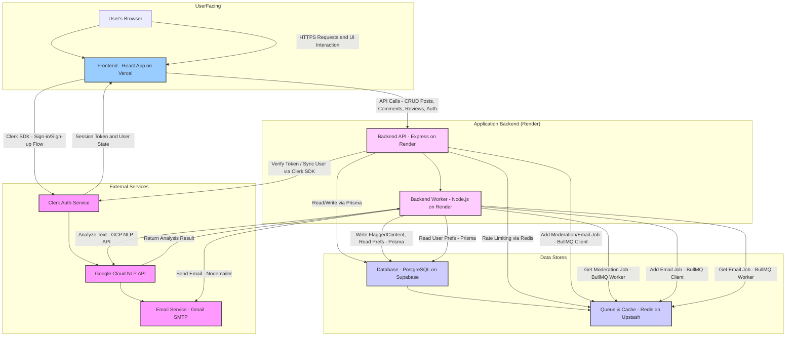

# AI-Powered Content Moderation Microservice

A production-ready content moderation microservice that uses AI to detect and flag inappropriate content, built with a modern PERN stack (PostgreSQL, Express, React, Node.js).


[](https://moderation-three.vercel.app/)
[](https://moderation-nzol.onrender.com/health/)


## Overview

This microservice scans user-generated content (comments and reviews) for inappropriate content and flags it for moderation. It offers a complete workflow for content creation, AI-based analysis, notification, and administrative review.


## Features

- **AI-powered moderation** using Google Cloud NLP
- **User authentication** with Clerk
- **Post, comment, and review** functionality
- **Email notifications** for flagged content
- **Admin dashboard** for managing flagged content
- **Role-based access control** (RBAC)
- **Scalable architecture** with queue-based processing
- **Containerized** with Docker
- **Light/dark mode** support
- **Responsive design** for all devices

## Architecture

### System Design


The system follows a modern microservice architecture:

1. **Frontend**: React application with TailwindCSS and Shadcn UI components
2. **Backend API**: Express.js server exposing RESTful endpoints
3. **Database**: PostgreSQL database managed through Prisma ORM
4. **Queue System**: Redis with BullMQ for asynchronous processing
5. **AI Service**: Google Cloud NLP for content moderation
6. **Notification System**: Email notifications via Nodemailer

### Content Moderation Flow

1. User submits content (comment/review)
2. Content is stored in the database
3. Moderation job is queued in Redis
4. Worker processes job and calls Google NLP API
5. If content is flagged, it's marked for review
6. User receives notification about flagged content
7. Admin reviews flagged content and approves/rejects
8. User receives notification about moderation decision

## Documentation

### API Documentation

The API is fully documented using OpenAPI/Swagger:

- **Swagger UI:** [https://moderation-nzol.onrender.com/api/docs](https://moderation-nzol.onrender.com/api/docs)
- **Postman Collection:** Available in the [/postman](/postman) directory

### Architecture Documentation

Detailed architecture documentation is available in the [/docs](docs) directory:

- [System Overview](docs/system-overview.md)
- [Database Schema](docs/database-schema.md)
- [Queue System](docs/queue-system.md)
- [Security Implementation](docs/security.md)

## Deployment

The application is deployed across multiple services:

- **Frontend**: Deployed on Vercel
- **Backend API**: Deployed on Render
- **Database**: PostgreSQL on Supabase
- **Redis**: Upstash Redis service

For detailed instructions to help you regarding the deployment of this project, see [deployment.md](docs/deployment.md)

## Tech Stack

### Backend
- **Express.js**: Backend framework
- **Prisma**: ORM for database operations
- **PostgreSQL**: Database (via Supabase)
- **BullMQ + Redis**: Queue processing for scalability
- **Google Cloud NLP**: AI text moderation
- **Nodemailer**: Email notifications
- **Clerk**: Authentication service
- **Swagger/OpenAPI**: API documentation

### Frontend
- **React**: UI framework
- **TailwindCSS**: Utility-first CSS framework
- **Shadcn UI**: UI component library
- **React Query**: Data fetching and caching
- **React Router**: Client-side routing
- **Clerk React**: Authentication UI components
- **Axios**: HTTP client

### DevOps
- **Docker**: Containerization
- **GitHub Actions**: CI/CD pipeline
- **Sentry**: Error monitoring

## Local Development

### Prerequisites

- Node.js v18 or newer
- pnpm
- PostgreSQL database
- Redis server
- Google Cloud account with NLP API enabled
- Clerk account

### Setup

1. Clone the repository:
   ```bash
   git clone https://github.com/sanskarpan/moderation.git
   cd moderation
   ```

2. Install dependencies:
   ```bash
   # Install backend dependencies
   cd backend
   pnpm install
   
   # Install frontend dependencies
   cd ../frontend
   pnpm install
   ```

3. Set up environment variables:
   - Create `.env` in the backend directory based on `.env.sample`
   - Create `.env` in the frontend directory based on `.env.sample`

4. Initialize the database:
   ```bash
   cd backend
   pnpm prisma migrate dev
   pnpm prisma db seed
   ```

5. Start the development servers:
   ```bash
   # Start backend (terminal 1)
   cd backend
   pnpm dev
   
   # Start worker process (terminal 2)
   cd backend
   pnpm worker
   
   # Start frontend (terminal 3)
   cd frontend
   pnpm start
   ```

### Docker

Alternatively, run everything using Docker:

```bash
docker-compose up -d
```

## Project Status

This project has been developed as a fully functional microservice for content moderation. All core requirements have been implemented and tested:

- ✅ User authentication
- ✅ Content creation endpoints
- ✅ AI-powered moderation
- ✅ Admin review system
- ✅ Notification system
- ✅ Queue-based processing

Future enhancements under consideration:
- Ensemble moderation with multiple AI services
- Mobile application
- Real-time updates using WebSockets
- Extended analytics dashboard

See [checklist.md](checklist.md) for a detailed progress tracking.

## License

This project is licensed under the MIT License - see the [LICENSE](LICENSE) file for details.

## Acknowledgements

- [Express.js](https://expressjs.com/)
- [React](https://reactjs.org/)
- [Prisma](https://www.prisma.io/)
- [Supabase](https://supabase.com/)
- [TailwindCSS](https://tailwindcss.com/)
- [Shadcn UI](https://ui.shadcn.com/)
- [Google Cloud NLP](https://cloud.google.com/natural-language)
- [Clerk Authentication](https://clerk.dev/)
- [BullMQ](https://docs.bullmq.io/)

